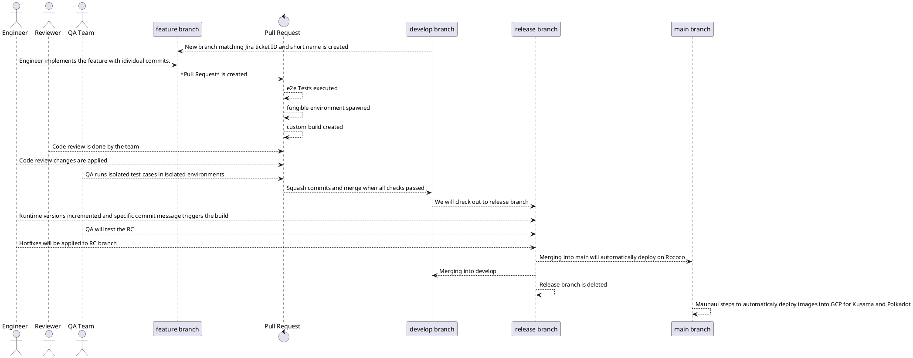
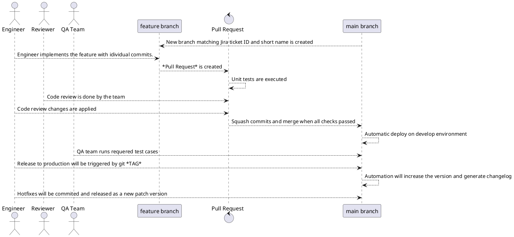

# Mangata Diagrams
Repository, where all diagrams are stored.

Set `plantuml:{filename}` as a fence information. `filename` is used as the file name of generated diagrams. In the following case, `md-sample-sequence.svg` is created.
`filename` is required.

## Mangata BE team workflow and release process

## Mangata FE team workflow and release process

