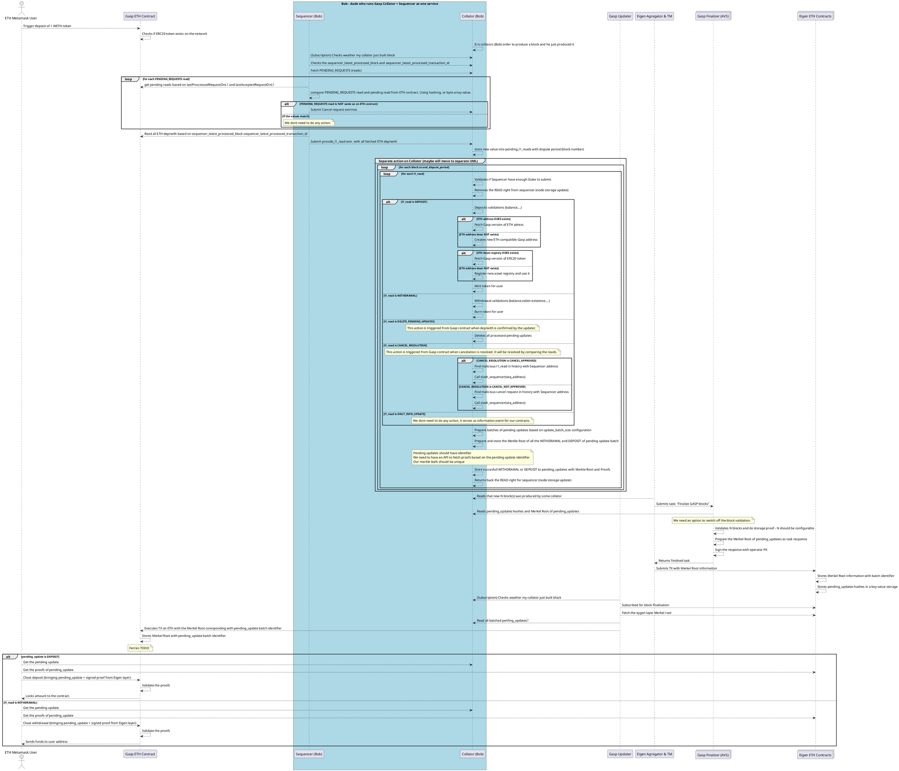
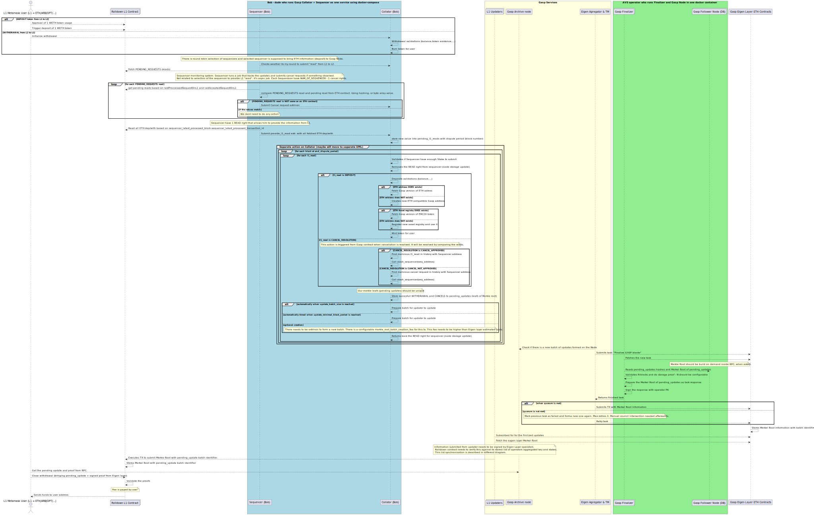
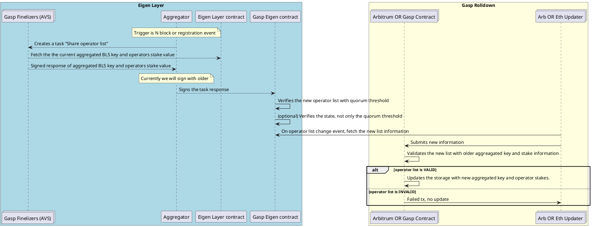
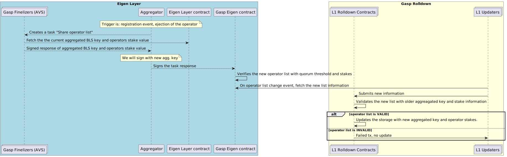

# Gasp Diagrams
Repository, where all diagrams are stored.

Set `plantuml:{filename}` as a fence information. `filename` is used as the file name of generated diagrams. In the following case, `md-sample-sequence.svg` is created.
`filename` is required.

Files will be uploaded to `https://storage.googleapis.com/mangata-diagrams/svg/*` folder that is public and URLs can be used anywhere needed.

## (ETH Rollup MVP) ETH -> Gasp -> Eigen Layer AVS Deposit/Withdrawal flow
`https://storage.googleapis.com/mangata-diagrams/svg/gasp-eth-rollup-mvp.svg`

## Operator list sharing
`https://storage.googleapis.com/mangata-diagrams/svg/operators-list-sharing.svg`

## Metamask EVM signing
`https://storage.googleapis.com/mangata-diagrams/svg/gasp-metamask-signing.svg`

## Gasp BE team workflow and release process
`https://storage.googleapis.com/mangata-diagrams/svg/be-workflow-and-release.svg`

## Gasp FE team workflow and release process
`https://storage.googleapis.com/mangata-diagrams/svg/fe-workflow-and-release.svg`

